# 🌿 OpenTrip Jejak Kita

**OpenTrip Jejak Kita** adalah website sistem booking perjalanan wisata alam untuk memungkinkan pengguna melihat daftar trip, lakukan pemesanan, hingga mengelola riwayat booking secara online.  
Website ini dibangun sebagai bagian dari proyek pembelajaran dan tugas akademik perkuliahan.

---

## 🎯 Fitur Utama
- Menampilkan daftar trip wisata alam
- Detail informasi trip
- Form booking perjalanan
- Keranjang booking
- Riwayat pemesanan
- Halaman tentang & testimoni

---

## 📸 Preview Tampilan Website

### 1️⃣ Dashboard
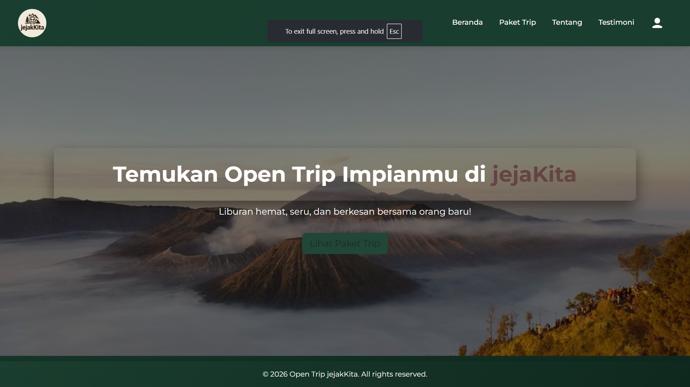

---

### 2️⃣ Homepage & Detail Trip
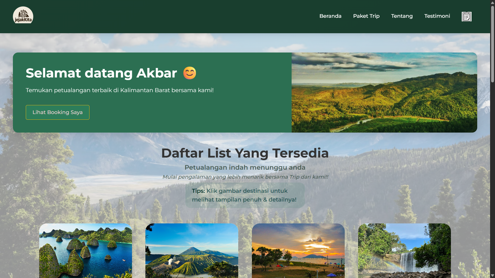  
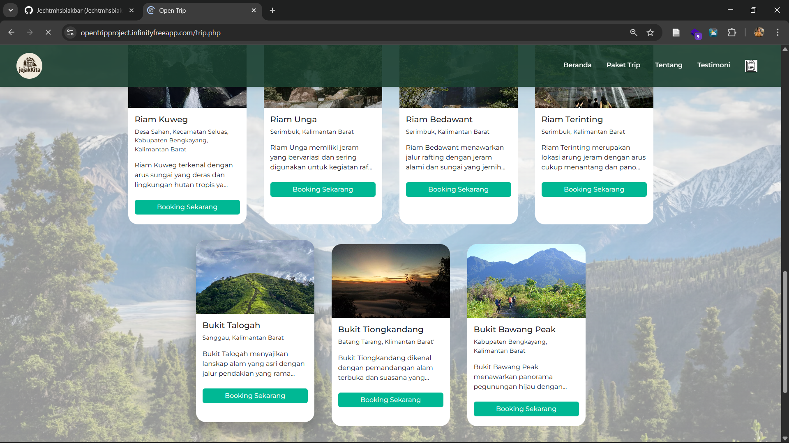  
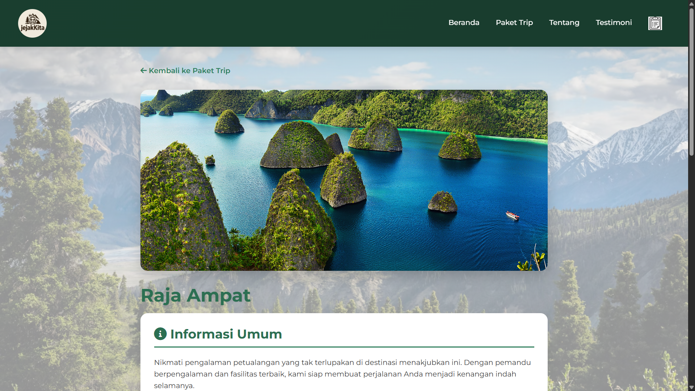

---

### 3️⃣ Form Booking
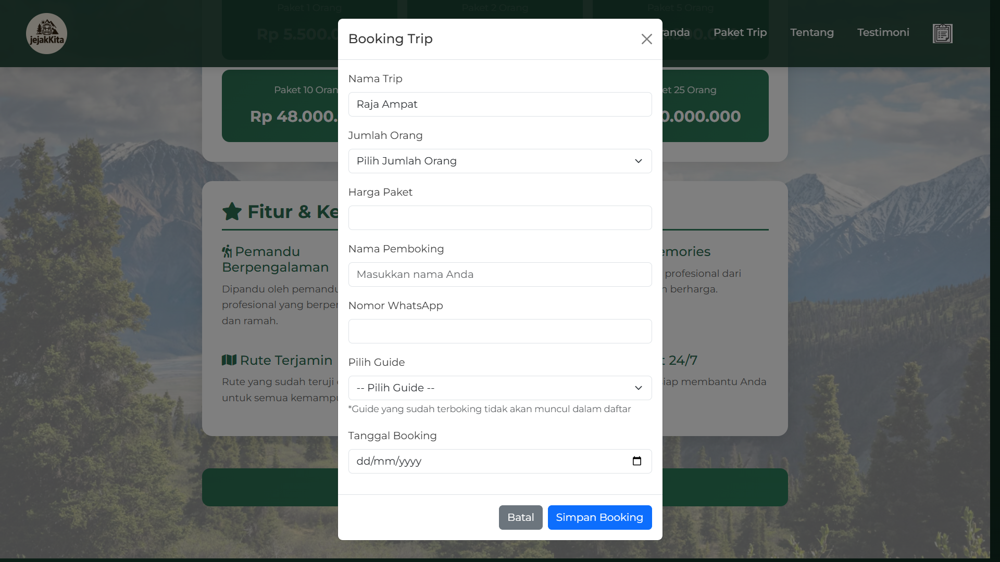

---

### 4️⃣ Cart Booking
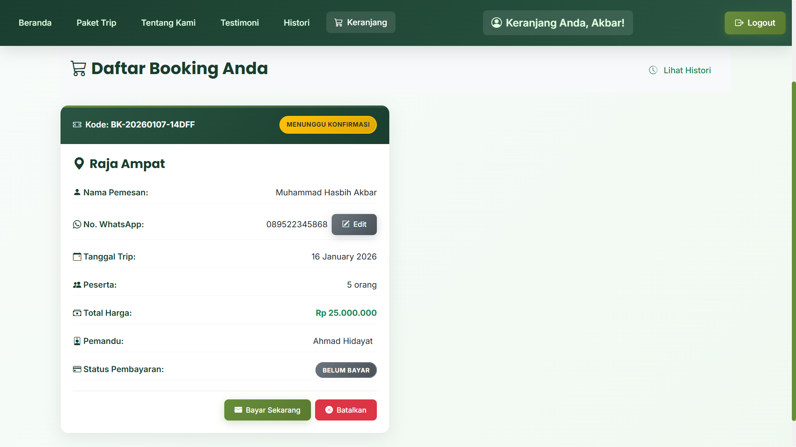

---

### 5️⃣ Riwayat Booking
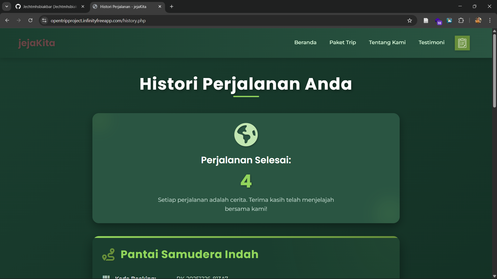  
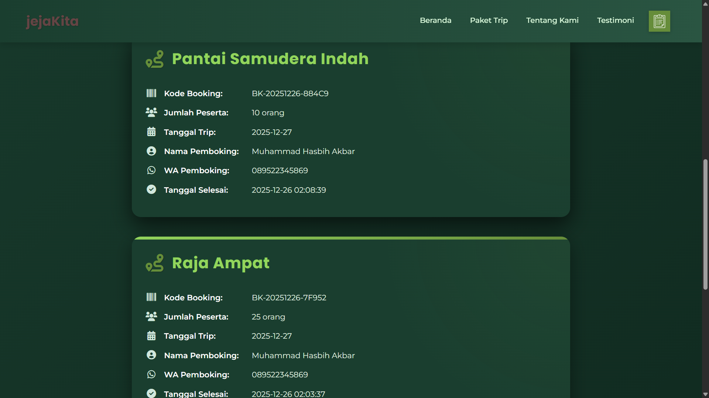

---

### 6️⃣ Halaman Tentang
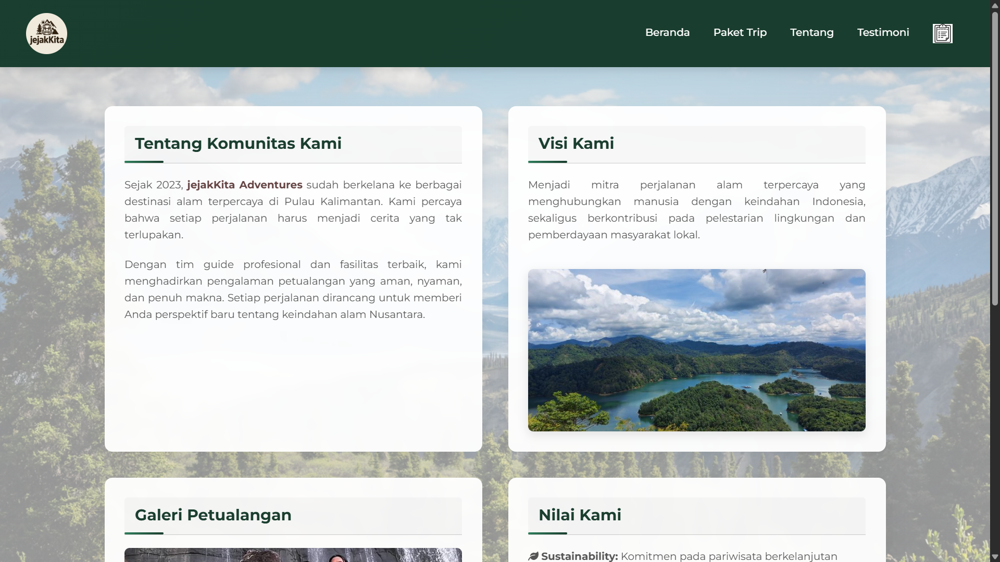  
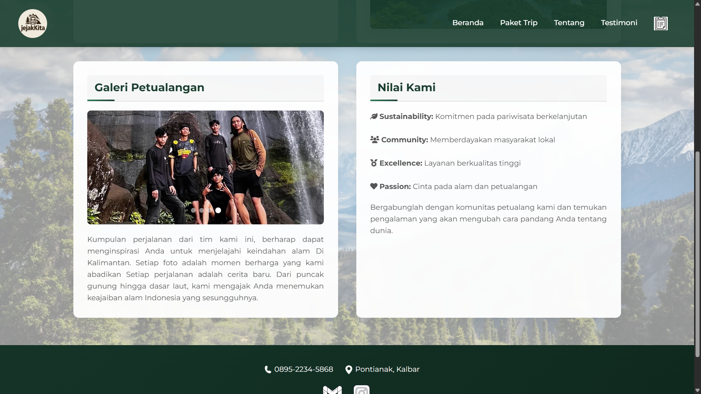

---

### 7️⃣ Halaman Testimoni
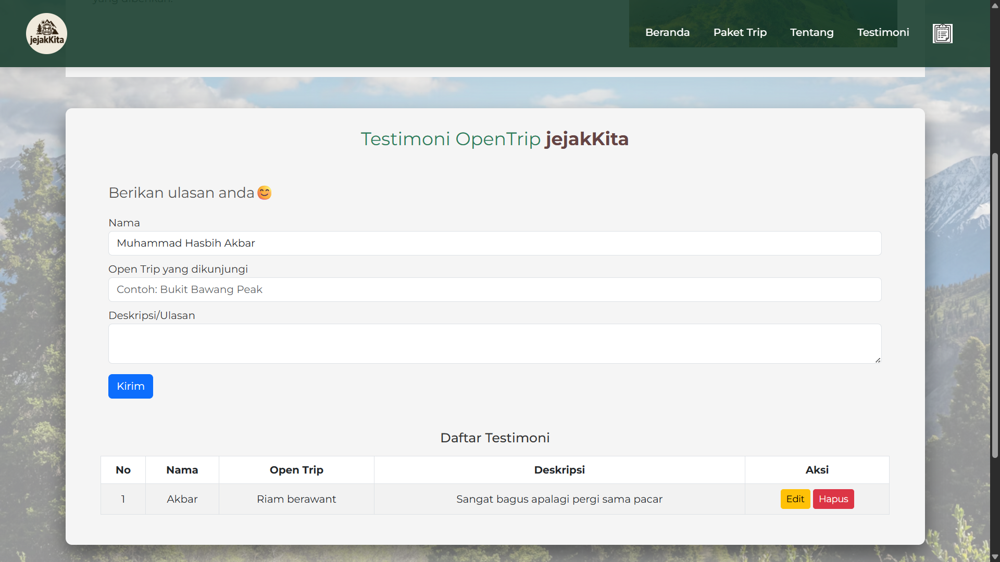

---

## 🛠️ Teknologi yang Digunakan
- PHP
- HTML & CSS
- JavaScript
- MySQL
- Apache (XAMPP)

---

## ⚠️ Catatan
Repository ini bersifat **public hanya untuk keperluan dokumentasi dan penilaian**.  
Source code lengkap dikelola secara terpisah.

---

👤 **Dikembangkan oleh:**  
Muhammad Hasbih Akbar, 
Silvando Miristica Adimawan, 
Fahmi Al-Islami
